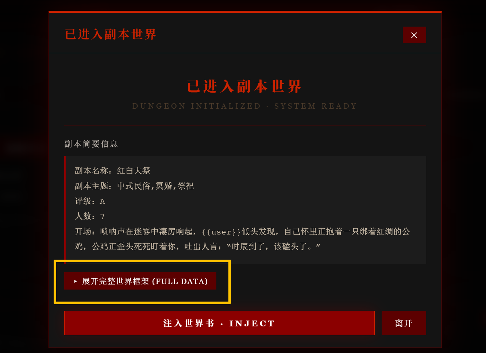
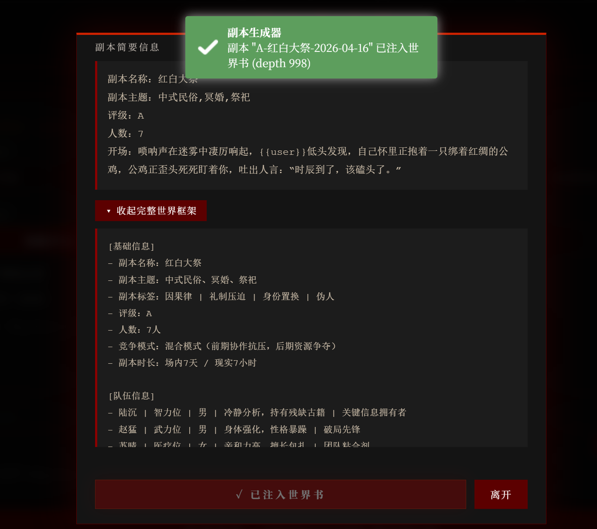
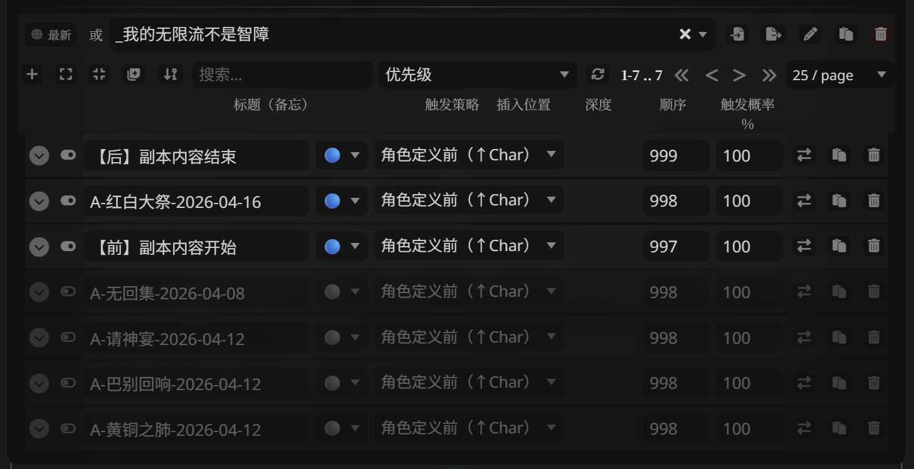

# 💀 无限流：副本生成器

* 脚本编写、教程作者：Gloria
* 本作品发布在Discord社区：旅程、尾巴镇、喵喵电波
* 脚本若有问题，可以随时在社区问我
* 最新版本：V2.1.2
* 更新时间：2026/04/30
* 获取方式：社区获取/github获取
* json：脚本全部版本
* cot：当前脚本大纲适配的副本推进cot（大概？）
---

# 📑 目录

* [🗝️ 功能简介](#-功能简介)
* [🚀 安装与使用教程](#-安装与使用教程)
* [🧠 生成器与提示词解析](#-生成器与提示词解析)
* [❓ 常见问题](#-常见问题)
* [📝 更新日志](#-更新日志)
* [🧭 全系列导航](#-全系列导航)——同系列前后两作，三件套配合使用效果更佳


---

# 🗝️ 功能简介

首先，这是一个帮助剧情推进的工具，并不能写剧情，而是从副本设计师的角度出发，生成有关副本的设计大纲。

**用于：**
* 恐怖故事
* 无限流跑团
* 副本任务设计
* 大世界嵌套副本
* 快穿 / 多世界切换

**生成内容包括但不限于：**
* 世界结构
* 规则系统
* 信息不对称设计
* 反转与张力埋点

针对AI模型不会埋伏笔、没有条理的问题，这个生成器的作用是：
**提前构建“副本逻辑骨架”**
让模型：
* 有规则可遵循
* 有机制可推进
* 有真相可收束

**核心玩法：**
* 包含可扩展提示词系统+可编辑生成器
* 支持自动生成 + 世界书注入
* 预设系统支持保存多项配置/导出 JSON/导入他人预设
* 可以为角色卡定制副本风格/构建个人副本库

---

# 🚀 安装与使用教程

---

## 1 安装脚本
非常正常的导入操作：
下载 JSON 文件
打开酒馆助手
导入脚本
<p align="center">
  
</p>
启用：「魔法棒 → 副本生成器」
<p align="center">
  
</p>

---

## 2 前期配置

### 四种主题
除“生门”外都有吓人小彩（巧）蛋（思）
<p align="center">
  
</p>

### API配置
很基础的配置方法，API URL/API Key/Model，不多赘述
<p align="center">
  
</p>

### 提示词设置
支持修改和保存预设，如果对自己的副本有特殊要求可以在这里修改（可以参照下面的详细介绍）
默认 Prompt 已优化，新手建议完全不改直接用
<p align="center">
  
</p>

---

## 3 生成器配置

### 基础载入
该部分支持界面（按钮）编辑，如果不需要可以直接选择（可多选，如果不想选就点随机或不选）
下面讲一下自定义版面的方法，点击“编辑”进入编辑界面
<p align="center">
  
</p>
进入后可以删除/添加按钮
如果想要添加一个按钮，直接选择后面的“自定义即可”
添加多个按钮和解释，点击批量导入，一行是一个按钮
<p align="center">
  
</p>

全部弄完点击“确认”即可
**该编辑部分可以保存在预设，支持导入和导出**

### 逻辑模组
* **竞争模式**：PVE是队友间没有竞争，PVP是队友会打架，自行选择
* **参与者姓名**：需不需要自定义队友姓名
* **输出语言**：如果你不想被剧透，选择“加密”，导入世界书的大纲是你看不懂的西语
* **用户特殊设定**：{{user}}不是副本玩家的时候开启，可以选择自己想在副本当的东西（你想当boss吗？）
* 稍微复杂一点的是“用户特殊设定”和“融合设定”
<p align="center">
  
</p>

“融合设定”是融入角色卡的信息，融合前务必配置好
点击“注入配置”或前往设置界面的“世界观注入”（该部分支持保存预设）
* **用户设定描述**：{{user}}的设定，自行粘贴
* **角色描述**：角色卡”角色描述“部分
* **注入最新聊天记录**：注入最后一层的聊天记录
玩法：跑剧情跑到进入副本之后用副本生成器开启此条目，可以根据这一层的内容补全全部副本大纲
* **角色卡世界书条目**：点击**挂载条目**，选择所需条目
* 全部配置好即可返回，完成全部配置
<p align="center">
  
</p>

---

### 4 生成副本
点击“生成世界”，弹出确认界面，展示信息和tokens
如果你想检查你想要的部分是否全部导入，点击黄色部分
<p align="center">
  
</p>

模型加载成功界面如下，注意，简要信息和是否加密无关（都是中文），且不会剧透
生成逻辑是：
* `<dungeon>`：完整副本
* `<dungeon_info>`：摘要
所以，如果生成失败，可能是模型不听话，包裹错了部分，可以选择重新roll，或者看一下全部内容，如果没问题也可可以导入（因为摘要不会导入世界书，无伤大雅）
若想要看全部内容，点击黄色部分
<p align="center">
  
</p>

如果你对生成的内容还算满意，点击“注入世界书”，自动创建一个新的世界书并注入（第一次，之后都在这个世界书里）
世界书名**_我的无限流不是智障**
显示下面条目说明导入成功，可以打开世界书查看
<p align="center">
  
</p>

目前写了一个简单的条目，使用前后包裹住副本并做了防剧透，条目和层数都可以自行更改
世界书使用的时候请手动挂载，跑完副本需要自行关闭，每次把副本导入世界书都会默认开启
<p align="center">
  
</p>

**接下来请放心大胆的进入无限流副本世界吧！**

---

## 5 预设导入 / 导出
* 在“核心设置”最下面，很好理解，选择需要的条目导入即可
* 导入的时候做了防覆盖，所以可以放心大胆的导入
* 这个功能是给想要备份/分享自己做的面板准备的，希望可以看到更多的好模板~

---

# 🧠 生成器与提示词解析

---
* 接下来属于进阶版教程，如果你想要修改提示词/生成器配置，请看这里了解整体逻辑。
* 首先，提示词当中包含对于生成器词条的描述，并且生成器的内容会影响输出大纲的副本难度/配置/主题等。
* **总结：**
强相关的部分（建议一起联动修改）：
```
MODULE 0（也就是生成器配置）
MODULE 2（将配置和模板内容关联）
MODULLE 3（模板内容）
```
下面是详细介绍：
---

## Prompt 架构总览

整个生成器的 Prompt 被拆成 4 个模块：

```
MODULE 0：参数注入（你填的配置）
MODULE 1：知识库（不要动）
MODULE 2：规则系统（最重要）
MODULE 3：输出模板（结构控制）
MODULE 4：输出约束（格式控制）
```

---

## MODULE 0 · 参数输入（不要改！）

这是生成器 UI 的内容注入位置：

```
{{MODULE_0_BLOCK}}
```
包含：
* 副本主题 / 评级 / 人数
* 模式（PVE / PVP）
* 用户特殊设定（是否是Boss/NPC）
* 是否融合世界书
* 聊天记录注入

**因为这里是全部输入内容，你不需要修改这里**

---

## MODULE 1 · 知识库（可调整）

这一块是**整个生成器的“世界观素材库”**

包含：
* 副本类型库
* 怪物库
* NPC库
* 场景库
* 规则库
* 副本设计原则

个人认为可以包含大部分无限流副本逻辑了，但可以按照喜好修改
如果想要让副本和你新增的主题更加关联，
修改**副本类型库**：此部分目前和主题内容强相关
NPC/场景/规则和输出框架强相关，特殊需要可以修改

---

## MODULE 2 · 规则系统（最重要）

* 目前最应该理解/可以修改的部分，和生成器内容强相关
* 下面介绍可以按照你认为的难度修改的部分：


### 1 评级系统

**如果你对自己的系统有新的评级，可在这里删改**
例如：
```
E / D / C / B / A / S / SSS
```
控制：
* 副本长度
* 死亡率
* 机制复杂度
* 是否有隐藏规则
* 是否允许无解


## 2 人数系统

控制：
* 信息分布方式
* 是否有内鬼
* 社会博弈强度


## 3 模式系统（PVE / PVP / 混合）

控制：
* 玩家关系
* 道具设计
* NPC作用

---

## MODULE 3 · 输出结构（看到的大纲）

输出内容包含：
```
[基础信息]
[队伍信息]
[世界背景]
[机制系统]
[场景]
[道具]
[NPC]
[Boss]
[反转点]
[开场钩子]
```

### 关键设计点
* 世界观结构：表层设定 → 真相层（核心：信息不对称）
* 机制绑定世界：核心规则，让模型能杀人、能误导、能反转
* 反转点设计：不会触发，只会埋点

### 修改建议
* 此部分是核心内容，修改会影响整体输出，并且和module 2的内容强相关，谨慎修改
* 建议不要删掉核心结构，仅修改“写作参考”微调即可
* **但是希望可以看到更好的模板！**

---

## MODULE 4 输出约束（别乱改！）

这里非常重要：
```
<dungeon> ... </dungeon>
<dungeon_info> ... </dungeon_info>
```
* 脚本会解析这两个标签为：副本正文/简要信息
* 除非你想修改“副本简要信息”的输出，可以修改此部分内容

---

# ❓ 常见问题

### Q1：推荐用什么模型？
* gemini2.5 pro/3.1 pro（最推荐，最稳定）
* gemini 3 flash（有时候格式会崩，但也会有意想不到的效果）
* 没试过别的

### Q2：没有按钮/有按钮打不开？
* 请在社区给我看报错，最好用电脑端，F12开发者模式给我看报错（error）
* 不过本人代码能力也是一坨，可以尝试先问ai

---

# 📝 更新日志

## v2.1.2
* 新增：世界书条目修正模式，支持选择已有条目并生成修正版内容
* 新增：生成结果页重新生成按钮，复用上次配置与提示词再次生成
* 优化：生成界面新增“取消”按钮

## v2.0.2
- 新增：大总结功能，支持AI智能全文大总结

## v2.0.1
- 修改：部分移动端界面裁切的bug
- 删除：“使用酒馆主API”功能有问题，肘不过，先删除了

## v2.0.0
- 新增：添加了特殊user身份的设定，选择后user可以不只是玩家，想当npc还是boss还是系统，想调戏谁自己决定！
- 新增：支持导入/导出：如果想要为自己的角色卡配置预设，又想备份/给别人玩，现在可以选择导出想要的预设内容，导入的话也会添加进去。欢迎一起设计自己想要的提示词和面板~

## v1.7.0
- 新增：新增编辑功能，支持生成器界面自定义按钮，编辑内容可以保存在生成器预设中

## v1.6.0
- 修改：弹窗目前全部重写，目前可以支持全屏显示了，观感也会更好~

## v1.5.4
- 优化：小更新，优化UI和防误触

## v1.5.1
- 新增：生成器、世界观设置、提示词均新增预设功能
- 新增：新增日间护眼-国风（诡谲民俗）主题

## v1.4.0
- 修改：修改了底层逻辑的适配性
- 新增：加了一个很喜欢的赛博朋克风格配色~

## v1.3.4
- 修改：整体修正了角色卡信息读取的bug，整体看起来也更简洁了
- 修改：user信息目前读取还是有问题，但是设置的按钮旁边添加了手动输入，可以暂时先用
- 新增：类型和评级增加了添加按钮，可以自定义模块了，测试了一下ai能读的
- 优化：还有一些排版和字体的小捉虫，希望没有问题辽

---

# 🧭 全系列导航

* 目前已完成了较为完整的三部曲制作——从最初想要做一个副本大纲生成器，到呼声比较高的案件生成，最后完成了自由度最高的番外生成。
* 在此感谢大家的帮助和支持，如果喜欢当前作品，欢迎看看其他两个小工具：


---

## ⚖️ 案件推演台·MYSTERY ENGINE

> 从案件设计的角度出发，生成完整的案件流程骨架，帮助 AI 维持动机-手法-机会三锁、不漏线索、不崩真相、反转只埋不触发。

🔗 [gloria-yin/MYSTERY\_ENGINE](https://github.com/gloria-yin/MYSTERY_ENGINE)

**用于：** 推理案件跑团 / 侦探剧情 RP / 本格·社会派·硬核·反转风格 / 多案关联·跨案元谜题 / 快穿单元案件

**生成内容：** 案件世界观 / 人物图谱 / 双轨时间线 / 线索库 + 核心突破线索链 / 真相还原 + 多结局框架 / 嵌套模式跨案结构
 预设导入导出 / 人物库跨案复用

---

## 🌙 番外织梦阁·SPINOFF WEAVER

> 自由度最高的番外剧本生成器，从平行时空到深度机制碰撞，搭建完整舞台供你自由 RP，并支持跨番外联动的连载级番外宇宙。

🔗 [gloria-yin/SPINOF\_WEAVER](https://github.com/gloria-yin/SPINOF_WEAVER)

**用于：** 平行时空 RP / 特殊机制碰撞 / 穿越快穿支线 / 连载级番外宇宙

**生成内容：** 情境快照 / 动态事件池 / 多维走向框架 / 任务系统 / 跨番外联动继承结构

---

# ⭐ 最后

如果你也在玩无限流，欢迎一起交流，嘿嘿
