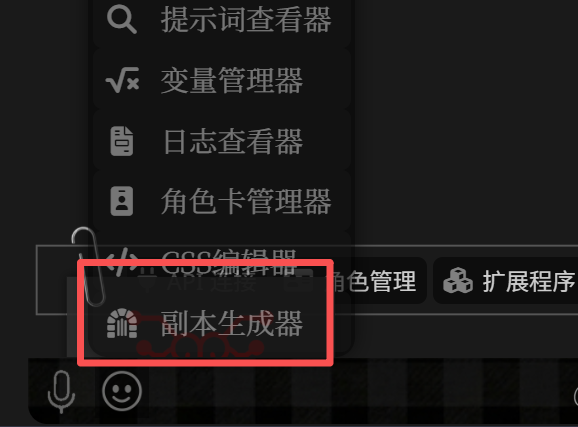
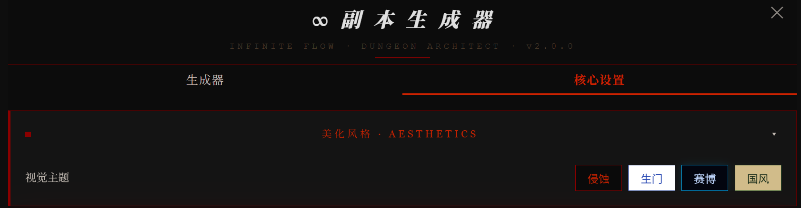
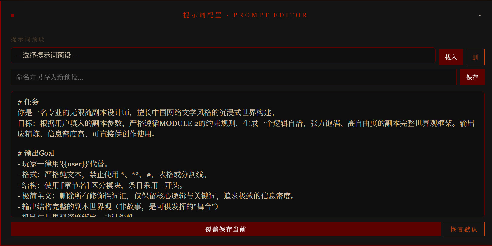
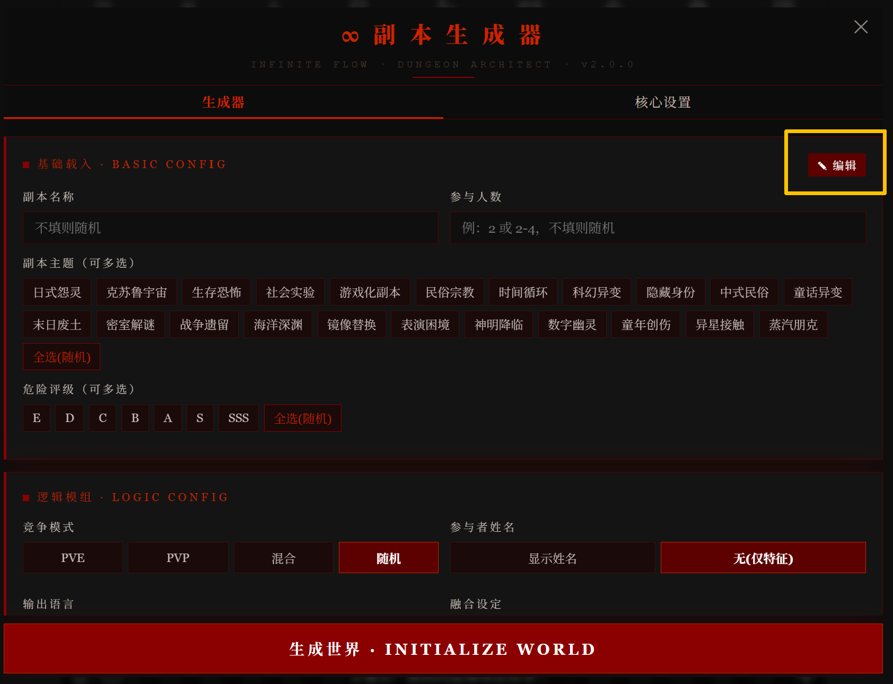
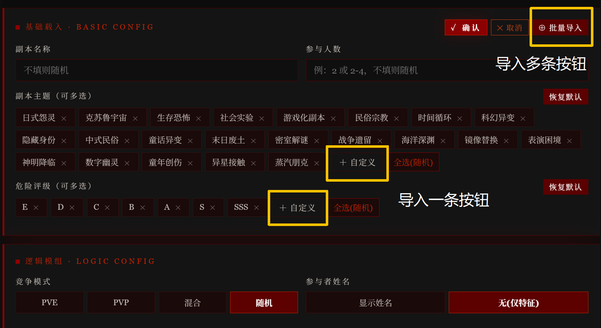
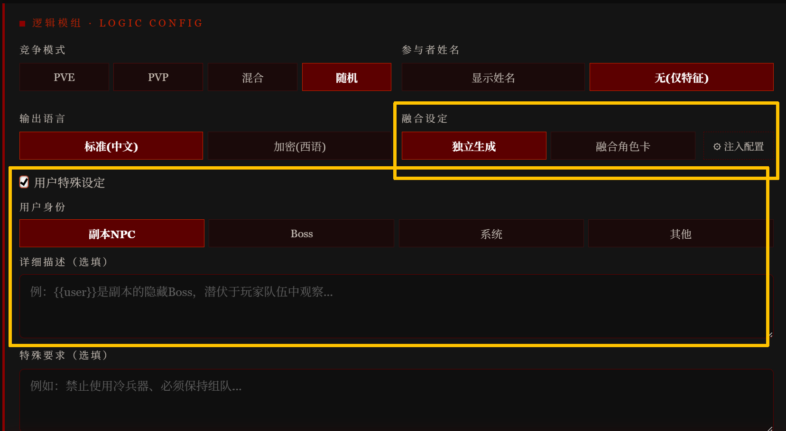
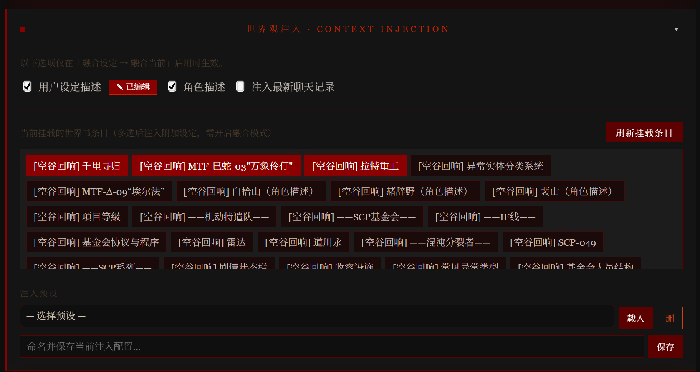
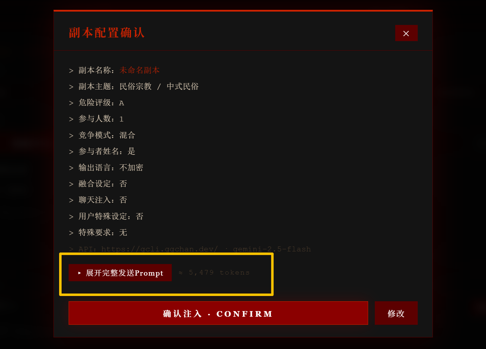

# 💀 无限流：副本生成器 V2.0.1

* 脚本编写、教程作者：Gloria
* 本作品发布在Discord社区：旅程、尾巴镇、喵喵电波
* 脚本若有问题，可以随时在社区问我
* 最新版本：V2.0.1（修复移动端裁切bug、删除使用酒馆API
* 更新时间：2026/04/16
---

# 📑 目录

* [🗝️ 功能简介](#-功能简介)
* [🚀 安装与使用教程](#-安装与使用教程)
* [🧠 生成器与提示词解析](#-生成器与提示词解析)
* [❓ 常见问题](#-常见问题)
* [📝 更新日志](#-更新日志)

---

# 🗝️ 功能简介

首先，这是一个帮助剧情推进的工具，并不能写剧情，而是从副本设计师的角度出发，生成有关副本的设计大纲。

**用于：**
* 恐怖故事
* 无限流跑团
* 副本任务设计
* 大世界嵌套副本
* 快穿 / 多世界切换

**生成内容包括但不限于：**
* 世界结构
* 规则系统
* 信息不对称设计
* 反转与张力埋点

针对AI模型不会埋伏笔、没有条理的问题，这个生成器的作用是：
**提前构建“副本逻辑骨架”**
让模型：
* 有规则可遵循
* 有机制可推进
* 有真相可收束

**核心玩法：**
* 包含可扩展提示词系统+可编辑生成器
* 支持自动生成 + 世界书注入
* 预设系统支持保存多项配置/导出 JSON/导入他人预设
* 可以为角色卡定制副本风格/构建个人副本库

---

# 🚀 安装与使用教程

---

## 1 安装脚本
非常正常的导入操作：
下载 JSON 文件
打开酒馆助手
导入脚本
<p align="center">
  
</p>
启用：「魔法棒 → 副本生成器」
<p align="center">
  
</p>

---

## 2 前期配置

### 四种主题
除“生门”外都有吓人小彩（巧）蛋（思）
<p align="center">
  
</p>

### API配置
很基础的配置方法，API URL/API Key/Model，不多赘述
<p align="center">
  
</p>

### 提示词设置
支持修改和保存预设，如果对自己的副本有特殊要求可以在这里修改（可以参照下面的详细介绍）
默认 Prompt 已优化，新手建议完全不改直接用
<p align="center">
  
</p>

---

## 3 生成器配置

### 基础载入
该部分支持界面（按钮）编辑，如果不需要可以直接选择（可多选，如果不想选就点随机或不选）
下面讲一下自定义版面的方法，点击“编辑”进入编辑界面
<p align="center">
  
</p>
进入后可以删除/添加按钮
如果想要添加一个按钮，直接选择后面的“自定义即可”
添加多个按钮和解释，点击批量导入，一行是一个按钮
<p align="center">
  
</p>
全部弄完点击“确认”即可
**该编辑部分可以保存在预设，支持导入和导出**

### 逻辑模组
* **竞争模式**：PVE是队友间没有竞争，PVP是队友会打架，自行选择
* **参与者姓名**：需不需要自定义队友姓名
* **输出语言**：如果你不想被剧透，选择“加密”，导入世界书的大纲是你看不懂的西语
* **用户特殊设定**：{{user}}不是副本玩家的时候开启，可以选择自己想在副本当的东西（你想当boss吗？）
* 稍微复杂一点的是“用户特殊设定”和“融合设定”
<p align="center">
  
</p>

“融合设定”是融入角色卡的信息，融合前务必配置好
点击“注入配置”或前往设置界面的“世界观注入”（该部分支持保存预设）
* **用户设定描述**：{{user}}的设定，自行粘贴
* **角色描述**：角色卡”角色描述“部分
* **注入最新聊天记录**：注入最后一层的聊天记录
玩法：跑剧情跑到进入副本之后用副本生成器开启此条目，可以根据这一层的内容补全全部副本大纲
* **角色卡世界书条目**：点击**挂载条目**，选择所需条目
* 全部配置好即可返回，完成全部配置
<p align="center">
  
</p>

---

### 4 生成副本
点击“生成世界”，弹出确认界面，展示信息和tokens
如果你想检查你想要的部分是否全部导入，点击黄色部分
<p align="center">
  
</p>

可以保存：

* 当前配置
* 快速复用

---

## 6️⃣ 世界观配置

【插图位置：世界书选择界面】

勾选要注入的：

* 世界书条目
* 角色信息
* 聊天记录

---

## 7️⃣ 点击生成（查看 token & prompt）

【插图位置：生成过程截图】

点击：

```id="genbtn"
生成世界 · INITIALIZE WORLD
```

会发生：

1. 构建 Prompt
2. 发送 API
3. 返回结果

👉 可查看：

* prompt 内容
* token 消耗

---

## 8️⃣ 生成结果查看

【插图位置：输出界面截图】

结果分为：

* `<dungeon>`：完整副本
* `<dungeon_info>`：摘要

---

## 9️⃣ 自动导入世界书

【插图位置：注入按钮截图】

点击：

```id="injectbtn"
注入世界书 · INJECT
```

👉 副本将写入：

```
_我的无限流不是智障
```

⚠️ 注意：

* 需要手动挂载世界书
* 副本结束建议关闭

---

## 🔟 预设导入 / 导出

【插图位置：导入导出界面】

支持：

* 精确导出
* 防覆盖导入
* JSON 分享

---

# 🧠 生成器与提示词解析

---

## 一、生成器参数影响逻辑

### 1. 评级（最重要）

👉 对应 MODULE 2：

* 决定：

  * 难度
  * 真相层数
  * 死亡率
  * Boss阶段

---

### 2. 人数

影响：

* 信息分配
* 内鬼机制
* 场景复杂度

---

### 3. 模式

* PVE：合作
* PVP：对抗
* 混合：前合作后背刺

---

## 二、Prompt 结构解析（核心）

你的 Prompt 分为：

---

### MODULE 0：输入层

👉 来自生成器配置

---

### MODULE 1：知识库

👉 无限流“规则体系”

可自行扩展（非常推荐）

---

### MODULE 2：约束层（最关键）

👉 和生成器完全绑定：

* 评级约束
* 人数约束
* 模式约束

👉 本质：**控制生成质量**

---

### MODULE 3：输出模板

👉 定义结构：

必须包含：

* 世界
* 机制
* NPC
* Boss

---

### MODULE 4：输出格式

⚠️ 必须保留：

```id="mustformat"
<dungeon>...</dungeon>
<dungeon_info>...</dungeon_info>
```

否则：

👉 脚本无法解析

---

## 三、Prompt 修改指南

可以改：

* MODULE 1（知识库）
* MODULE 3（输出细节）

不建议改：

* MODULE 2（会破结构）
* 标签结构

---

# ❓ 常见问题

---

### Q1：为什么生成质量不稳定？

👉 原因：

* API 模型不稳定
* Prompt 被改坏
* 世界书冲突

---

### Q2：为什么没有生成完整结构？

👉 检查：

* 是否包含 `<dungeon>`
* token 是否不足

---

### Q3：为什么世界书没生效？

👉 可能：

* 没挂载
* 深度冲突

---

### Q4：API 报错怎么办？

👉 检查：

* URL 是否带 `/v1`
* Key 是否正确

---

# 📝 更新日志

---

## v2.0.1

* Prompt 架构升级（MODULE 0~4）
* 新增：

  * 用户身份覆写
  * 世界书融合
  * 标签系统
* 优化：

  * UI
  * 世界书注入逻辑
* 修复：

  * API 兼容问题

---

## v2.0.0

* 首次完整版本发布
* 引入副本生成框架
* 初版 UI 与 Prompt 系统

---

# ⭐ 最后

如果你也在做无限流：

👉 欢迎一起把这个系统玩到极致
